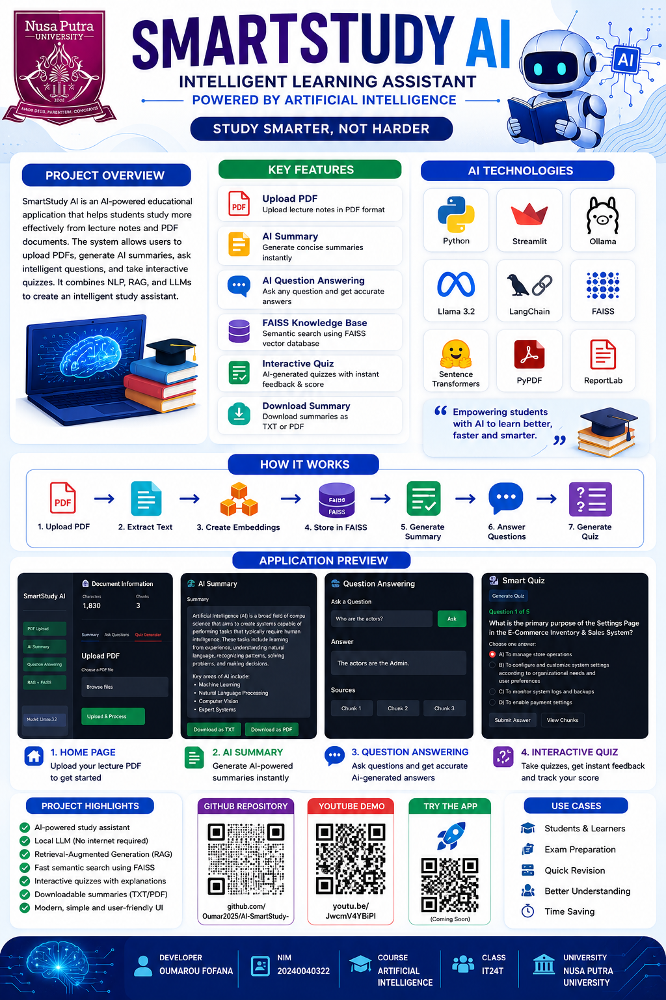
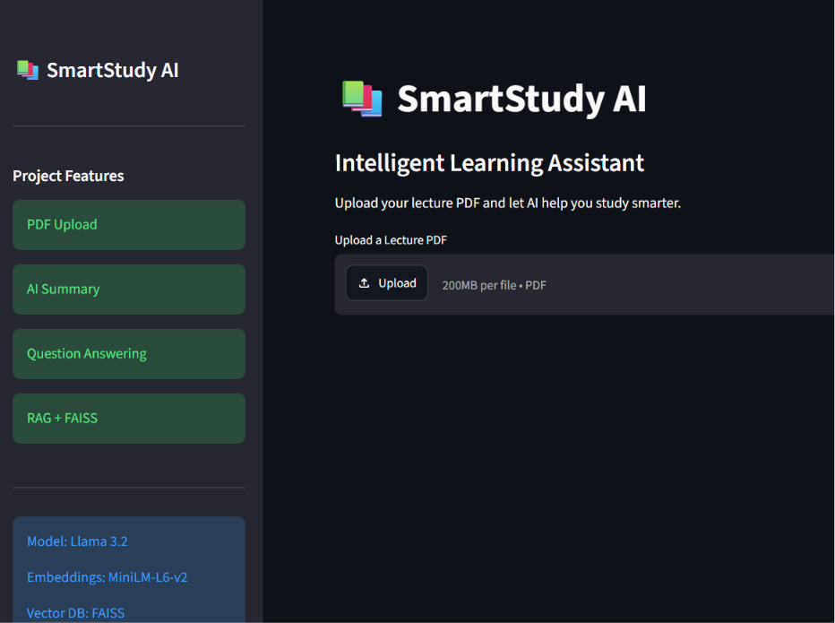
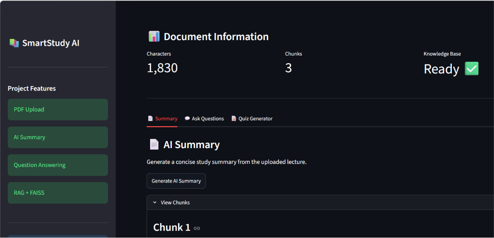
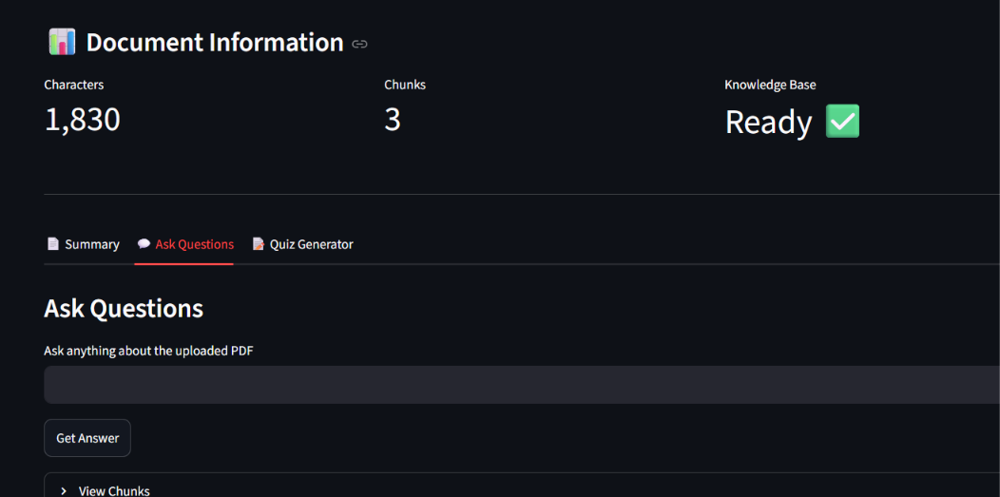
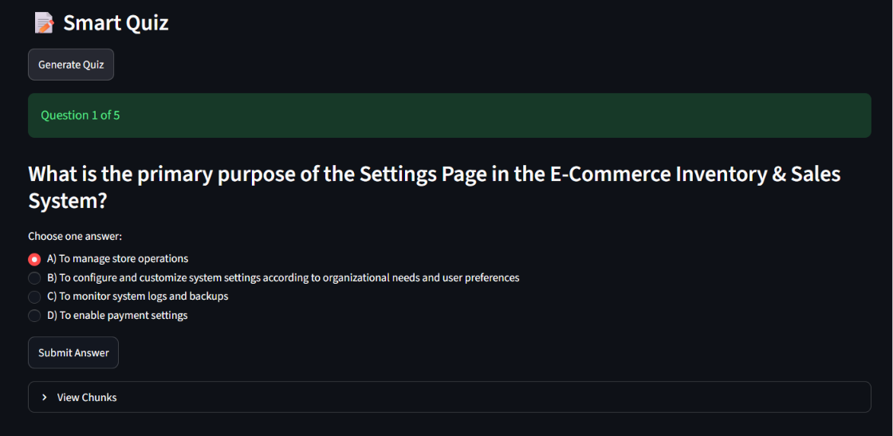
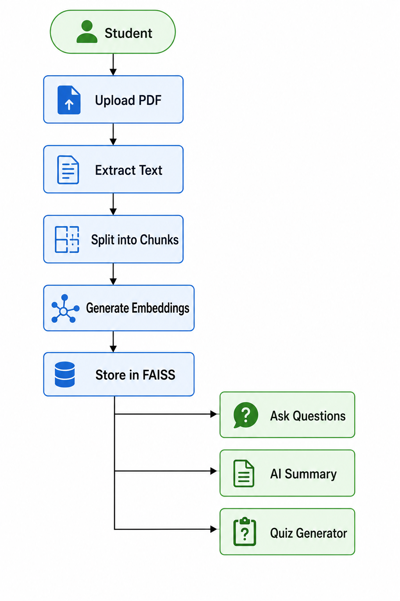

# 📚 SmartStudy AI

> An Intelligent AI-Powered Learning Assistant built with Streamlit, Ollama, LangChain and FAISS.


---

# Overview

SmartStudy AI is an Artificial Intelligence learning assistant that helps students study more efficiently from lecture notes and PDF documents.

Instead of reading long documents manually, students simply upload their lecture PDF and the AI automatically:

- summarizes the lecture
- answers questions about the document
- builds its own searchable knowledge base
- generates interactive quizzes
- grades student answers instantly

The application combines Natural Language Processing (NLP), Retrieval-Augmented Generation (RAG), Large Language Models (LLMs), and Vector Search to create an intelligent study companion.

---

# Demo (https://drive.google.com/file/d/1qXpDQfs9HAnRPGqySHp8lWwo_6sPBGdB/view?usp=sharing)

# Poster:
    

# Problem Statement

Students often struggle to:

- read lengthy lecture notes
- remember important concepts
- prepare for exams
- locate information quickly inside PDFs

SmartStudy AI solves these problems by allowing students to interact with their documents using Artificial Intelligence.

---

# AI Technologies Used

This project uses several modern AI technologies:

- Large Language Models (LLMs)
- Natural Language Processing (NLP)
- Retrieval-Augmented Generation (RAG)
- Sentence Embeddings
- Vector Similarity Search
- Local AI Inference

---

# Tech Stack

| Technology | Purpose |
|------------|----------|
| Python | Programming language |
| Streamlit | User Interface |
| Ollama | Local AI model runtime |
| Llama 3.2 (3B) | Language Model |
| LangChain | AI orchestration |
| FAISS | Vector Database |
| Sentence Transformers | Text Embeddings |
| PyPDF | PDF Text Extraction |
| ReportLab | PDF Export |

---

# Project Features

## PDF Upload

- Upload lecture PDFs
- Automatic text extraction
- Preview extracted content

---

## AI Summary

Generate concise study notes automatically using Llama 3.2.

Features:

- AI-generated summaries
- Download summary as TXT
- Download summary as PDF

---

## Intelligent Question Answering

Students can ask any question related to the uploaded document.

Uses:

- Retrieval-Augmented Generation (RAG)
- FAISS Vector Database
- Semantic Search

If the answer does not exist inside the uploaded document, SmartStudy AI informs the user instead of hallucinating.

---

## Knowledge Base

Every uploaded document is automatically:

- split into chunks
- converted into embeddings
- indexed inside FAISS

This allows accurate semantic searching.

---

## Smart Quiz Generator

Automatically creates multiple-choice quizzes from lecture notes.

Features:

- AI-generated questions
- Four answer options
- Instant grading
- Explanation after each question
- Score tracking
- Final quiz score

---

## Interactive Learning

Students receive immediate feedback after answering every question.

Correct answers:
- ✅ Green feedback

Incorrect answers:
- ❌ Shows correct answer
- 💡 Explains why

---

# Project Structure

```
SmartStudy_AI/

│
├── app.py
│
├── components/
│   ├── header.py
│   ├── sidebar.py
│   ├── metrics.py
│   ├── summary_tab.py
│   ├── question_tab.py
│   └── quiz_tab.py
│
├── utils/
│   ├── chatbot.py
│   ├── pdf_reader.py
│   ├── embeddings.py
│   ├── vector_store.py
│   ├── pdf_export.py
│   └── ui.py
│
├── assets/
│
├── data/
│
├── screenshots/
│
├── requirements.txt
│
└── README.md
```

---

# Installation

Clone the repository

```bash
git clone https://github.com/Oumar2025/AI-SmartStudy-.git
```

Move into the project

```bash
cd AI-SmartStudy-
```

Create virtual environment

```bash
python -m venv .venv
```

Activate environment

Windows

```bash
.venv\Scripts\activate
```

Install dependencies

```bash
pip install -r requirements.txt
```

---

# Install Ollama

Download:

https://ollama.com/download

Install the Llama model

```bash
ollama pull llama3.2:3b
```

Start Ollama

```bash
ollama serve
```

If you receive

```
Only one usage of each socket...
```

that simply means Ollama is already running.

---

# Run the Project

```bash
streamlit run app.py
```

The application opens in your browser automatically.

---

# How It Works

```
PDF Upload
      │
      ▼
Text Extraction
      │
      ▼
Chunking
      │
      ▼
Embeddings
      │
      ▼
FAISS Vector Store
      │
      ├──────────────► Question Answering
      │
      ├──────────────► AI Summary
      │
      └──────────────► Quiz Generator
```

---


# 🖥️ Application Preview


## Home Page



---

## AI Summary



---

## Question Answering



---

## Quiz Generator



---


# Example Workflow


---

# Future Improvements

- Flashcards
- Voice Assistant
- Speech-to-Text
- OCR for scanned PDFs
- User Accounts
- Cloud Deployment
- Study Progress Dashboard
- Dark/Light Themes
- Multi-document search
- Chat history
- Quiz timer
- Difficulty levels

---

# Educational Impact

SmartStudy AI helps students:

- save study time
- understand lecture notes faster
- prepare for exams
- practice with quizzes
- interact naturally with learning materials

---

# Author

**Oumar**

Bachelor of Information Technology

Artificial Intelligence Project

2025

GitHub

https://github.com/Oumar2025

---

# License

This project is for educational purposes.
